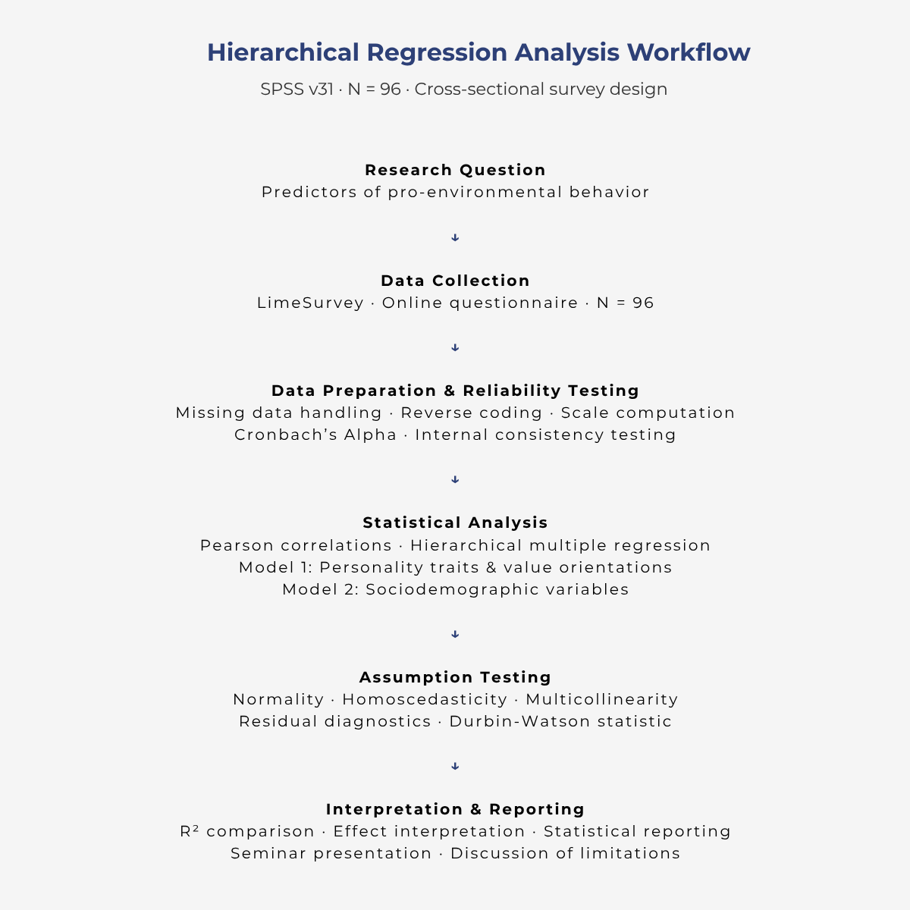
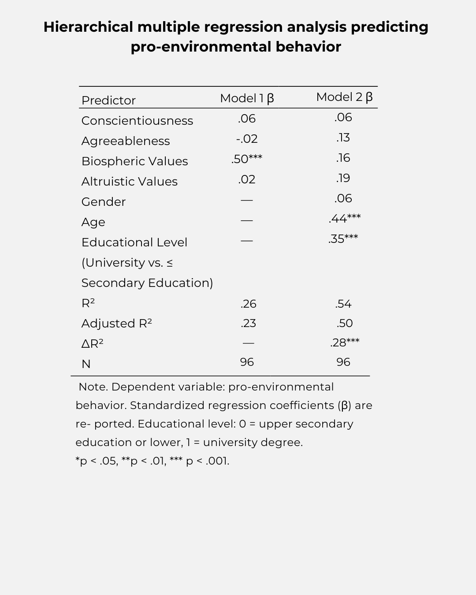

# Hierarchical Regression Analysis of Pro-environmental Behavior
This project was conducted as part of a university research seminar in psychology and examines predictors of pro-environmental behavior using quantitative statistical methods.
## Statistical Analysis Workflow

## Research Question

Which psychological and sociodemographic factors predict pro-environmental behavior?
## Methods

### Study Design
- Cross-sectional online survey
- Conducted using LimeSurvey
- Sample size: N = 96

### Statistical Analyses
- Pearson correlation analysis
- Hierarchical multiple linear regression
- Reliability analysis (Cronbach’s Alpha)
- Assumption testing:
  - Normality
  - Homoscedasticity
  - Multicollinearity
  - Residual diagnostics
  - Durbin-Watson statistic

### Software
- IBM SPSS Statistics Version 31
## Regression Models

### Model 1
- Conscientiousness
- Agreeableness
- Biospheric values
- Altruistic values

### Model 2
- Age
- Biological sex
- Educational level
## Key Findings

- The final regression model explained 54% of the variance in pro-environmental behavior (R² = .54).
- Age and educational level emerged as significant positive predictors.
- Biospheric values showed significant effects before controlling for sociodemographic variables.
## Hierarchical Regression Results

## My Contribution

My contribution to the project included:
- Conducting the statistical analyses in SPSS
- Assumption testing and regression diagnostics
- Interpretation of statistical findings
- Preparation of statistical reporting
- Presentation of the statistical results during the seminar
- Writing the statistical results section and contributing to the discussion section
