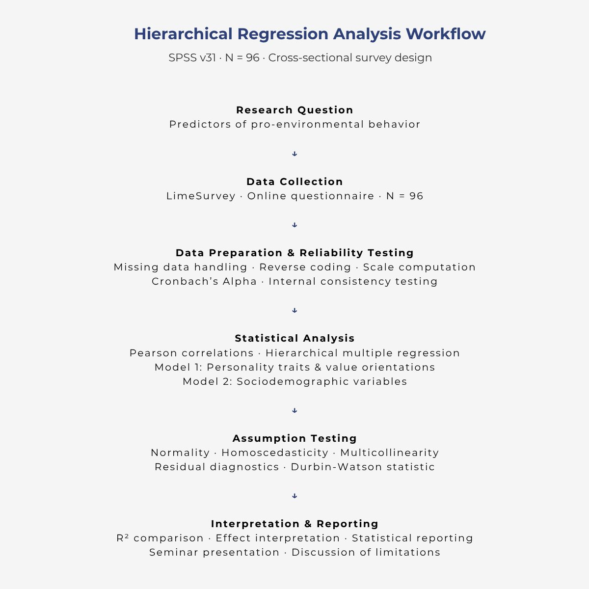
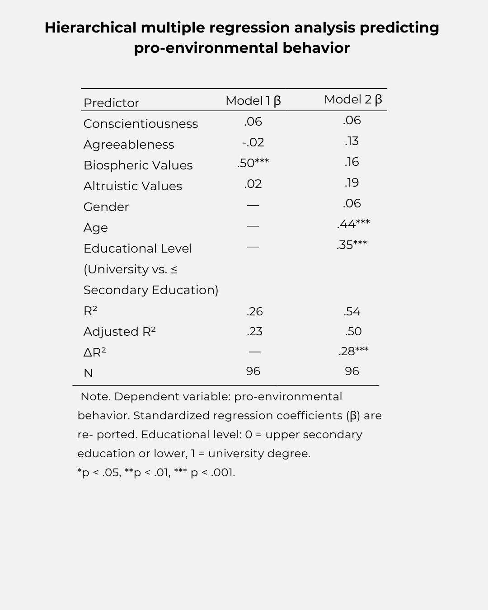

# Hierarchical Regression Analysis of Pro-environmental Behavior
This project was conducted as part of a university research seminar in psychology and examines predictors of pro-environmental behavior using quantitative statistical methods.
## Statistical Analysis Workflow

## Research Question

Which psychological and sociodemographic factors predict pro-environmental behavior?
## Methods

### Study Design
- Cross-sectional online survey
- Conducted using LimeSurvey
- Sample size: N = 96

### Statistical Analyses
- Pearson correlation analysis
- Hierarchical multiple linear regression
- Reliability analysis (Cronbach’s Alpha)
- Assumption testing:
  - Normality
  - Homoscedasticity
  - Multicollinearity
  - Residual diagnostics
  - Durbin-Watson statistic

### Software
- IBM SPSS Statistics Version 31
## Regression Models

### Model 1
- Conscientiousness
- Agreeableness
- Biospheric values
- Altruistic values

### Model 2
- Age
- Gender 
- Educational level
## Key Findings

* The first regression model, including conscientiousness, agreeableness, biospheric values, and altruistic values, was significant and explained **26% of the variance in pro-environmental behavior** (R² = .26, adjusted R² = .23). Among these theory-driven predictors, **biospheric values were the only significant predictor** (β = .50, p < .001), whereas conscientiousness, agreeableness, and altruistic values did not contribute significantly.

* Adding age, biological sex, and educational level in the second regression step **significantly improved the model**. The explained variance increased from **26% to 54%** (ΔR² = .28, p < .001), with the final model explaining 54% of the variance in pro-environmental behavior (adjusted R² = .50).

* In the final model, **age (β = .44, p < .001) and educational level (β = .35, p < .001)** were significant positive predictors of pro-environmental behavior. Participants who were older and those with a university degree reported higher levels of pro-environmental behavior. **Biological sex was not a significant predictor** (β = .06, p = .52).

* The effect of **biospheric values changed substantially after the sociodemographic variables were added**. While biospheric values were a strong and significant predictor in Model 1 (β = .50, p < .001), their coefficient decreased to β = .16 and was no longer statistically significant in Model 2 (p = .11). This indicates that their unique contribution was reduced after accounting for age, sex, and educational level.

* The bivariate analyses also showed significant positive associations between **age and pro-environmental behavior (r = .55, p < .001)** and between **educational level and pro-environmental behavior (r = .46, p < .001)**. Age was additionally positively associated with biospheric values (r = .38, p < .001).

* Overall, the hierarchical regression suggests that **sociodemographic variables accounted for a substantial additional share of variance beyond the theory-driven psychological predictors in this sample**, while the initial effect of biospheric values was no longer statistically significant after these variables were included.

## Hierarchical Regression Results

## My Contribution

My contribution to the project included:
- Conducting the statistical analyses in SPSS
- Assumption testing and regression diagnostics
- Interpretation of statistical findings
- Preparation of statistical reporting
- Presentation of the statistical results during the seminar
- Writing the statistical results section and contributing to the discussion section
